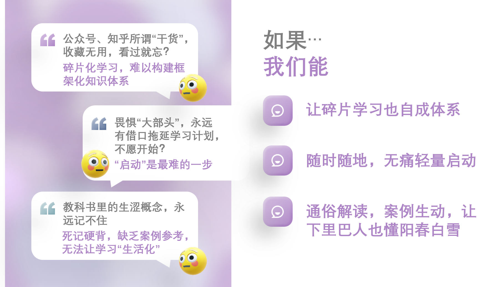
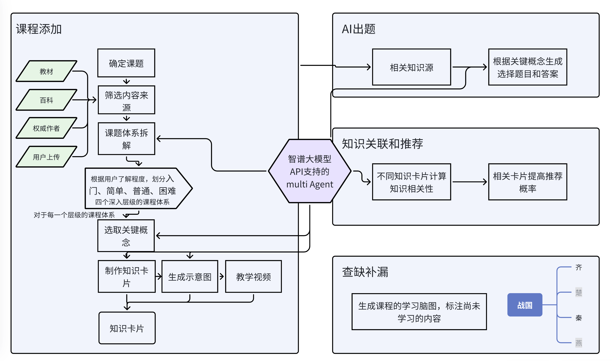

### 片刻：AI赋能的知识社交学习平台技术文档

---

#### 一、 概述

**1.1 项目背景**

随着AI技术的快速发展，知识生产和传播的方式发生了深刻变革。传统的专业内容生产者（PGC）模式逐渐被AI生成的基础内容所补充，用户对知识的获取和社交行为也发生了显著变化。为了满足用户对个性化、即时反馈和社交化学习的需求，我们推出了“片刻”——一款AI赋能的知识社交学习平台。

**1.2 产品定位**

“片刻”旨在打破传统学习模式，构建一个以用户为中心、AI辅助、社区共创的知识生态。通过卡片式知识点展示、沉浸式学习体验、个性化学习路径推荐、知识社区构建和智能学习助手等功能，为用户提供高效、便捷、有趣的学习体验。

---

#### 二、 核心技术架构

**2.1 系统架构**

“片刻”平台采用微服务架构，主要分为以下几个核心模块：

- **用户模块**：负责用户注册、登录、个人信息管理等功能。
- **内容模块**：负责知识卡片的生成、存储、展示和推荐。
- **社交模块**：负责用户间的互动、关注、讨论、排行榜等功能。
- **AI模块**：负责智能推荐、内容优化、练习题生成、个性化解答等功能。
- **数据模块**：负责用户行为数据的收集、分析和存储。

**2.2 技术栈**

- **前端**：React.js, Redux, WebSocket
- **后端**：Fastapi，Redis，Postgres
- **AI**：langchain，智谱AI，推荐模型
- **数据分析**：Apache Kafka, Apache Flink, Elasticsearch

---

#### 三、 核心功能实现

**3.1 内容形态：卡片式知识点展示**

**3.1.1 技术实现**

- **卡片生成**：使用AI模型（智谱GLM4-plus）自动生成知识卡片的内容，包括核心知识点、生动解释、实际应用场景等。
- **多媒体支持**：支持文字、图片、音频等多种媒体形式，通过前端框架（如React.js）实现动态加载和展示。
- **互动元素**：通过前端交互设计，实现小测试、点赞、收藏、分享等功能。

**3.1.2 优势**

- **信息密度高**：每张卡片包含丰富的知识点，适合碎片化学习。
- **易于传播**：卡片形式便于分享，提升用户参与度。

**3.2 交互设计：沉浸式学习体验**

**3.2.1 技术实现**

- **滑动操作**：通过前端手势识别技术（如Hammer.js）实现上下滑动切换卡片，左右滑动查看相关知识点。
- **点赞与收藏**：通过前端事件监听和后端API实现双击点赞、长按收藏功能。
- **一键分享**：集成第三方社交平台SDK，实现一键分享功能。

**3.2.2 优势**

- **操作简便**：符合用户使用习惯，提升用户体验。
- **增强粘性**：沉浸式交互设计增强用户粘性，提升用户活跃度。

**3.3 算法推荐：个性化学习路径**

**3.3.1 技术实现**

- **用户兴趣建模**：通过用户行为数据（如浏览历史、点赞、收藏等）构建用户兴趣模型。
- **知识图谱**：构建知识图谱，实现知识点之间的关联和难度递进。
- **推荐算法**：使用协同过滤、深度学习等算法，实现个性化推荐。

**3.3.2 优势**

- **精准匹配**：根据用户兴趣和学习进度，精准推荐学习内容。
- **提升效率**：个性化学习路径提升学习效率和效果。

**3.4 社交功能：构建知识社区**

**3.4.1 技术实现**

- **关注与讨论**：通过WebSocket实现实时关注和讨论功能。
- **排行榜**：通过后端数据分析和排序算法，实现知识创作者排行榜。
- **用户贡献**：通过前端表单和后端API，实现用户补充和纠正功能。

**3.4.2 优势**

- **促进交流**：构建知识社区，促进用户交流和知识共享。
- **激励创作**：通过排行榜和用户贡献机制，激励优质互动和创作。

**3.5 AI辅助系统：智能学习助手**

**3.5.1 技术实现**

- **知识框架生成**：使用AI模型（如GPT）自动生成知识框架。
- **内容优化**：根据用户反馈，使用AI模型优化内容质量。
- **练习题生成**：使用AI模型生成相关练习题，支持个性化解答。
- **智能推荐**：结合用户行为数据和知识图谱，实现智能推荐学习路径。

**3.5.2 优势**

- **降低门槛**：AI辅助系统降低内容生产门槛，提升内容质量。
- **提升效率**：智能学习助手提升学习效率和效果。

---

#### 四、 数据安全与隐私保护

**4.1 数据安全**

- **数据加密**：采用AES-256加密算法对用户数据进行加密存储。
- **访问控制**：通过RBAC（基于角色的访问控制）机制，实现对敏感数据的访问控制。
- **安全审计**：定期进行安全审计，确保系统安全。

**4.2 隐私保护**

- **数据匿名化**：对用户行为数据进行匿名化处理，保护用户隐私。
- **隐私政策**：制定详细的隐私政策，明确告知用户数据收集和使用方式。
- **用户授权**：在收集和使用用户数据前，获取用户明确授权。

---

#### 五、 未来展望

**5.1 技术演进**

- **AI模型优化**：持续优化AI模型，提升内容生成和推荐算法的准确性和效率。
- **多模态学习**：探索多模态学习（如文本、图像、音频、视频）的融合，提升学习体验。
- **跨平台支持**：开发移动端和桌面端应用，支持多平台学习。

**5.2 用户体验优化**

- **个性化定制**：提供更多个性化定制选项，满足不同用户的学习需求。
- **社区互动**：增强社区互动功能，提升用户参与度和活跃度。
- **国际化支持**：支持多语言和国际化内容，拓展全球用户。

---

#### 六、 总结

“片刻”作为一款AI赋能的知识社交学习平台，通过创新的技术架构和功能设计，为用户提供高效、便捷、有趣的学习体验。未来，我们将持续优化产品功能和用户体验，探索AI与知识学习的深度融合，成为知识社交领域的引领者。

---

**文档版本**：1.0  
**最后更新日期**：2024年10月27日  
**作者**：片刻团队